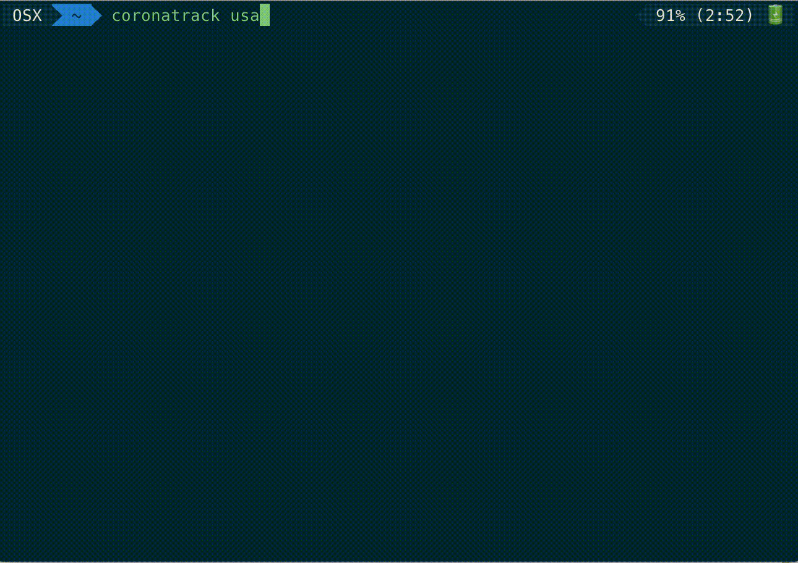

# covidshell
An application to track corona virus's effects at-a-glance in your terminal
## Installation
1. `npm install -g covidshell`
## Usage
There are different ways to view data with covidshell. You can view by country, by day, and/or by overall global. 
### Overall
`covidshell` gives you information on global deaths, death rate, cases, and recovered,
### By country
`covidshell countryName` gives you death, death rate, cases, and recovered information for a specific country.
ex: `covidshell india`
### By today
`covidshell countryName -t` gives you new cases and new deaths for a specific country, state, or overall.
ex: `covidshell china -t` `covidshell -t` `covidshell ny -t`
### By trend graph
`covidshell stateAbbreviation -gd/-gc` gives you a graph of death or cases in a specific country, or overall for the past 60 days.

ex: `covidshell india -gd` would give you a graph of deaths in the UK while
`covidshell -gc` gives a graph of recoveries globally.
### Help
`covidshell --help` gives you a full list of commands.
### Country names
`china`, `italy`, `iran`, `spain`, `germany`, `s. korea`, `france`, `usa`, `switzerland`, `uk`,
`netherlands`, `norway`, `austria`, `belgium`, `sweden`, `denmark`, `japan`, `diamond princess`,
`malaysia`, `canada`, `australia`, `portugal`, `qatar`, `czechia`, `greece`, `israel`, `finland`,
`brazil`, `ireland`, `slovenia`, `singapore`, `pakistan`, `bahrain`, `iceland`, `poland`, `estonia`,
`romania`, `chile`, `egypt`, `philippines`, `thailand`, `indonesia`, `saudi arabia`, `hong kong`, `iraq`,
`india`, `luxembourg`, `kuwait`, `lebanon`, `san marino`, `peru`, `russia`, `ecuador`, `uae`, `slovakia`, `mexico`,
`bulgaria`, `armenia`, `taiwan`, `serbia`, `panama`, `croatia`, `argentina`, `vietnam`, `colombia`, `south africa`,
`algeria`, `latvia`, `brunei`, `albania`, `hungary`, `cyprus`, `faeroe islands`, `turkey`, `morocco`, `sri lanka`,
`costa rica`, `palestine`, `jordan`, `andorra`, `malta`, `belarus`, `azerbaijan`, `georgia`, `cambodia`, `kazakhstan`,
`venezuela`, `north macedonia`, `moldova`, `uruguay`, `senegal`, `bosnia and herzegovina`, `lithuania`, `oman`, `tunisia`,
`afghanistan`, `dominican republic`, `liechtenstein`, `martinique`, `burkina faso`, `ukraine`, `macao`, `maldives`,
`new zealand`, `jamaica`, `bolivia`, `french guiana`, `uzbekistan`, `bangladesh`, `cameroon`, `monaco`,
`paraguay`, `réunion`, `guatemala`, `honduras`, `guyana`, `ghana`, `rwanda`, `channel islands`, `ethiopia`,
`guadeloupe`, `cuba`, `guam`, `mongolia`, `puerto rico`, `trinidad and tobago`, `ivory coast`, `kenya`, `seychelles`,
`nigeria`, `aruba`, `curaçao`, `drc`, `french polynesia`, `gibraltar`, `st. barth`, `barbados`, `liberia`, `montenegro`,
`namibia`, `saint lucia`, `saint martin`, `u.s. virgin islands`, `cayman islands`, `sudan`, `nepal`, `antigua and barbuda`,
`bahamas`, `benin`, `bhutan`, `car`, `congo`, `equatorial guinea`, `gabon`, `greenland`, `guinea`, `vatican city`,
`mauritania`, `mayotte`, `st. vincent grenadines`, `somalia`, `suriname`, `eswatini`, `tanzania`, `togo`
### State codes
`al`,
`ak`,
`as`,
`az`,
`ar`,
`ca`,
`co`,
`ct`,
`de`,
`dc`,
`fm`,
`fl`,
`ga`,
`gu`,
`hi`,
`id`,
`il`,
`in`,
`ia`,
`ks`,
`ky`,
`la`,
`me`,
`mh`,
`md`,
`ma`,
`mi`,
`mn`,
`ms`,
`mo`,
`mt`,
`ne`,
`nv`,
`nh`,
`nj`,
`nm`,
`ny`,
`nc`,
`nd`,
`mp`,
`oh`,
`ok`,
`or`,
`pw`,
`pa`,
`pr`,
`ri`,
`sc`,
`sd`,
`tn`,
`tx`,
`ut`,
`vt`,
`vi`,
`va`,
`wa`,
`wv`,
`wi`,
`wy`,
